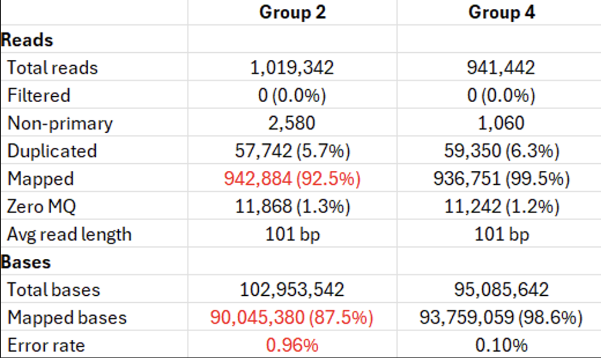
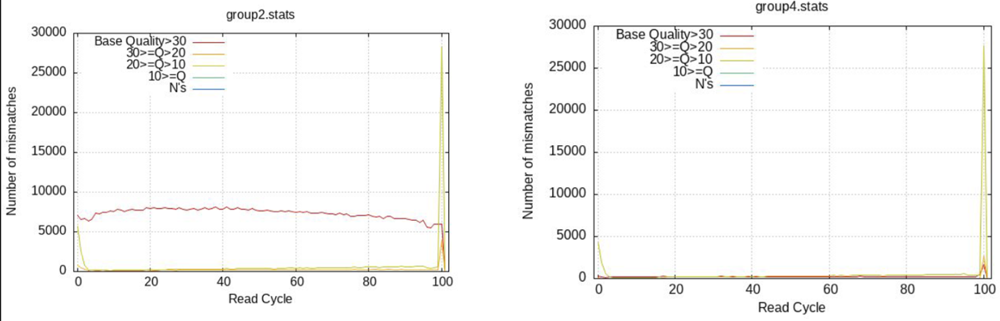
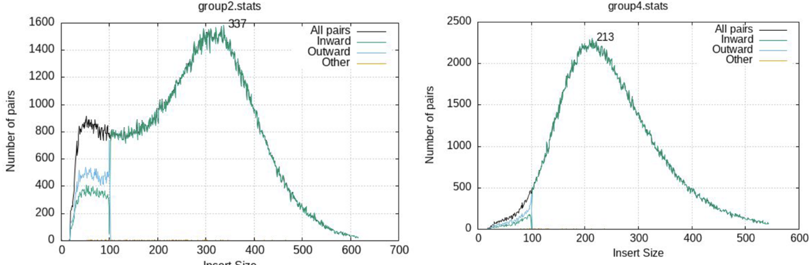
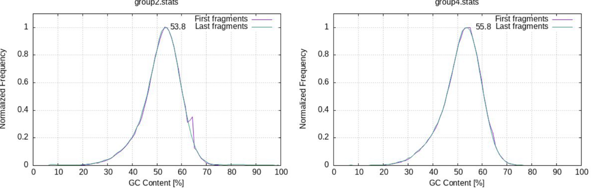

The description of this project can be found [here](https://wcscourses.github.io/Genome-Sequence-Analysis-Standardised-Resources/course_modules/Projects/project2/project2.html).

**Solution number 1 is is below.**

### Task 1: Align reads to the reference genome

Align the reads for each group with `bwa mem`, sort the alignments, mark duplicate reads, and index the resulting BAM files.

#### Group 2

``` bash
bwa mem -M -t 4 CP000886.fasta \
  Data/Group2_S2_L001_R1_001.fastq.gz \
  Data/Group2_S2_L001_R2_001.fastq.gz \
  | samtools sort -@ 4 -O bam -o Group2.sorted.bam

samtools index Group2.sorted.bam

picard MarkDuplicates \
  -I Group2.sorted.bam \
  -O Group2.markdup.bam \
  -M Group2.picard_metrics.txt

samtools index Group2.markdup.bam
```

#### Group 4

``` bash
bwa mem -M -t 4 CP000886.fasta \
  Data/Group4_S4_L001_R1_001.fastq.gz \
  Data/Group4_S4_L001_R2_001.fastq.gz \
  | samtools sort -@ 4 -O bam -o Group4.sorted.bam

samtools index Group4.sorted.bam

picard MarkDuplicates \
  -I Group4.sorted.bam \
  -O Group4.markdup.bam \
  -M Group4.picard_metrics.txt

samtools index Group4.markdup.bam
```

### Task 2: Assess alignment quality

Collect alignment statistics with `samtools stats` and generate QC reports with `plot-bamstats`.

``` bash
samtools stats Group2.markdup.bam \
  | plot-bamstats -p Group2_plot/alignment/ -

samtools stats Group4.markdup.bam \
  | plot-bamstats -p Group4_plot/alignment/ -
```

Open `Group2_plot/alignment/index.html` and `Group4_plot/alignment/index.html` in Firefox. Compare the reports and identify potential problems.

::: {.callout-note title="Expected observations"}
The Group 2 sample shows several abnormal QC patterns. Together, they suggest that its sequence differs substantially from the chosen reference and that contamination or library-preparation issues may also be present.
:::

#### Metrics summary

Group 2 has a lower mapping rate at both the read and base levels and a higher base-error rate.

{fig-alt="Alignment metrics summary comparing Group 2 and Group 4" width="70%"}

#### Mismatches per cycle

Group 2 is abnormal. High-quality mismatches (`Q > 30`, red line) are elevated and remain flat across all cycles, suggesting that the true sequence differs substantially from the reference. The isolate may be a different strain.

{fig-alt="Mismatches per cycle plots comparing Group 2 and Group 4" width="74%"}

#### Insert size

Group 2 is abnormal. A large plateau of outward-facing read pairs appears within the first 100 bases, followed by an abrupt cutoff. This pattern suggests mate-pair contamination or adapter-related issues.

{fig-alt="Insert-size plots comparing Group 2 and Group 4" width="74%"}

#### GC content

Group 2 is abnormal. A small but visible peak near 65% GC in the first fragment (purple) suggests minor contamination by an organism with higher GC content.

{fig-alt="GC-content plots comparing Group 2 and Group 4" width="95%"}

### Task 3: Call and filter variants

Call variants with BCFtools to produce a VCF file for each group. This step should take approximately five minutes per group.

Filter the calls using `QUAL >= 30` and `DP >= 20`.

#### Group 2

``` bash
bcftools mpileup -a AD -f CP000886.fasta Group2.markdup.bam -Ou \
  | bcftools call -mv -o Group2.vcf

bcftools filter -s LowQual -i 'QUAL>=30 && DP>=20' \
  Group2.vcf -o Group2.filtered.vcf
```

#### Group 4

``` bash
bcftools mpileup -a AD -f CP000886.fasta Group4.markdup.bam -Ou \
  | bcftools call -mv -o Group4.vcf

bcftools filter -s LowQual -i 'QUAL>=30 && DP>=20' \
  Group4.vcf -o Group4.filtered.vcf
```

#### Command explanation

-   `bcftools mpileup` computes per-base alignment statistics. The `-a AD` option adds allele-depth information, while `-Ou` produces an uncompressed BCF stream for piping.
-   `bcftools call` performs variant calling. The `-m` option uses the multiallelic calling model, and `-v` outputs variant sites only.
-   `bcftools filter -s LowQual` soft-filters variants. Instead of removing low-quality records, it labels them `LowQual` in the VCF `FILTER` column; passing records are labelled `PASS`. Retaining all records allows filtered variants to be revisited later.

#### Compare statistics before and after filtering

Calculate the numbers of SNPs and indels and the transition/transversion ratio before and after filtering.

``` bash
# Group 2
bcftools stats Group2.vcf | grep -E '^SN|^TSTV'
bcftools stats -i 'QUAL>=30 && DP>=20' Group2.vcf \
  | grep -E '^SN|^TSTV'

# Group 4
bcftools stats Group4.vcf | grep -E '^SN|^TSTV'
bcftools stats -i 'QUAL>=30 && DP>=20' Group4.vcf \
  | grep -E '^SN|^TSTV'
```

| Sample      | Metric | Before filtering | After filtering |
|:------------|:-------|-----------------:|----------------:|
| **Group 2** | SNPs   |           38,993 |          14,030 |
|             | Indels |              356 |              95 |
|             | TS/TV  |             3.38 |            3.83 |
| **Group 4** | SNPs   |               40 |               7 |
|             | Indels |               16 |               4 |
|             | TS/TV  |             0.90 |            1.33 |

### Task 4: Evaluate the sequencing run

Use the QC and variant-calling results to answer the following questions:

1.  Was the first sequencing run successful?
2.  Should the institute keep the sequencing instrument?
3.  What actions should the institute take before the next run?

::: {.callout-note title="Interpretation"}
Group 2 shows QC or contamination problems that produce a large number of likely false-positive variant calls. Review sample-preparation training and procedures, then repeat the sequencing run, ideally with several additional samples to help distinguish sample-specific problems from instrument-level problems.
:::
