# Assembly Solutions

## Genome Assembly

There are **no questions** in this section.

## PacBio Genome Assembly

There are **no questions** in this section.

## Assembly Algorithms

### Graph solution

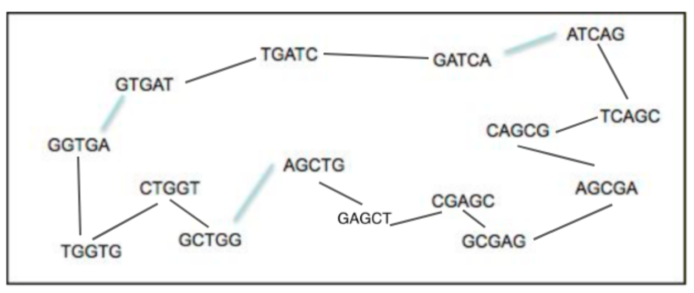{width="528"}

### Question 1

One possible assembled sequence is:

``` text
GGTGAGTGATTGATCGATCAATCAGTCAGCCAGCGAGCGAGCGAGCGAGCGAGCTAGCTGGCTGGCTGGTT
```

### Question 2

The sequence is **circular**, therefore the start position cannot be determined uniquely.

------------------------------------------------------------------------

## Illumina Genome Assembly

The assembly statistics should be similar to those shown in the practical.

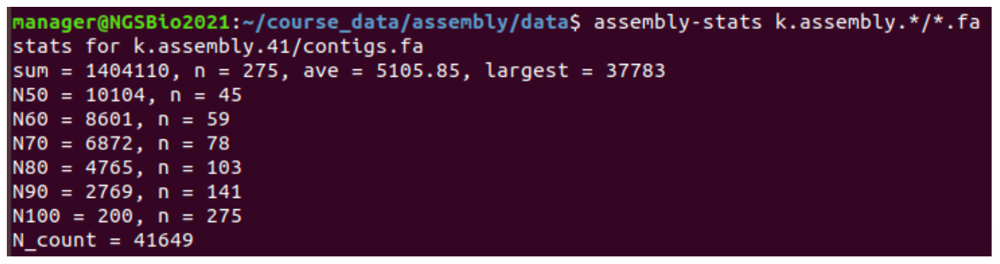

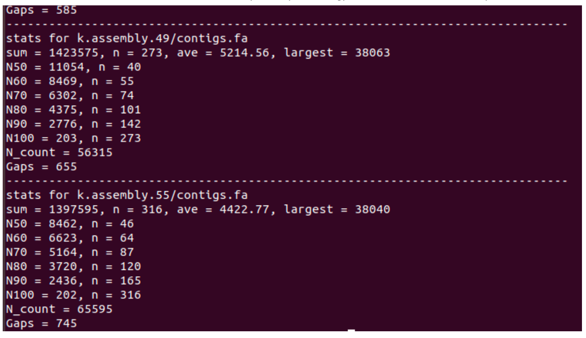

### Best k-mer

The best assembly is produced using a **k-mer of 49**.

### Summary table

| k-mer | Number of contigs |   N50 | Average contig length | Largest contig |
|------:|------------------:|------:|----------------------:|---------------:|
|    41 |               275 | 10140 |                  5105 |          37783 |
|    49 |               273 | 11054 |                  5214 |          38063 |
|    55 |               316 |  8462 |                  4422 |          38040 |

### Contigs vs scaffolds

| k-mer | Contig N50 | Scaffold N50 |
|------:|-----------:|-------------:|
|    41 |       2970 |        10140 |
|    49 |       2944 |        11054 |
|    55 |       2466 |         8462 |

------------------------------------------------------------------------

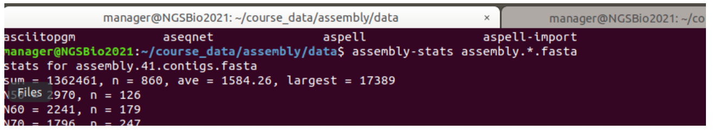

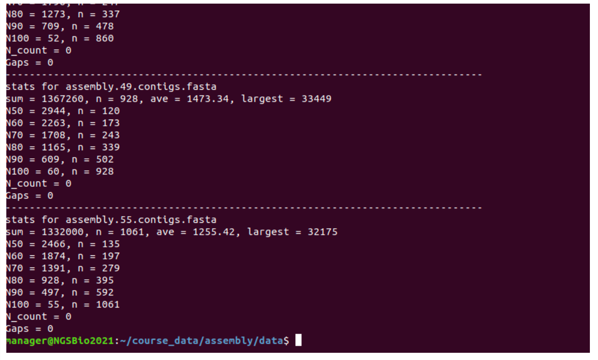

## Assembly Estimation

The GenomeScope output should be similar to that shown in the practical.

### Answers

1.  **Heterozygosity:** 0.451%
2.  **Estimated genome size:** 1.46 Mbp
3.  **Does this agree with expectations?** Yes. Chromosome 5 of *Plasmodium falciparum* IT is approximately **1.435 Mbp**.

------------------------------------------------------------------------

# PacBio Genome Assembly (continued)

## Generating assemblies

The practical compares **Canu** and **wtdbg2** assemblies.

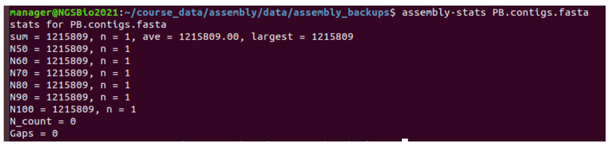

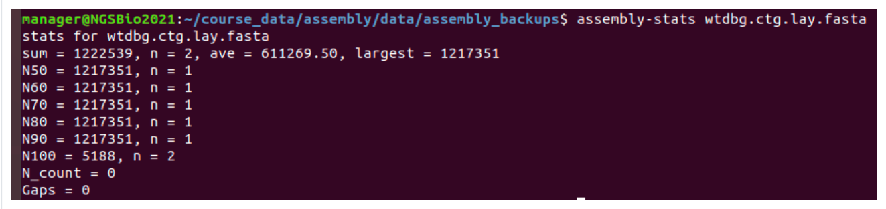

## Comparing assemblies

-   Both assemblies have very similar overall statistics.
-   **Canu** assembles the chromosome into **one contig**.
-   **wtdbg2** assembles it into **two contigs**.
-   Variant analysis shows that **wtdbg2 contains more variants** than the Canu assembly.

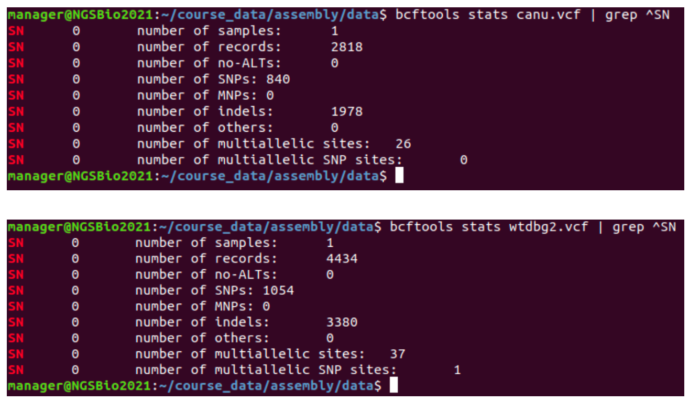

------------------------------------------------------------------------

## Polishing the PacBio Assembly

Reads are aligned back to the assemblies and variants are called against the polished assemblies.

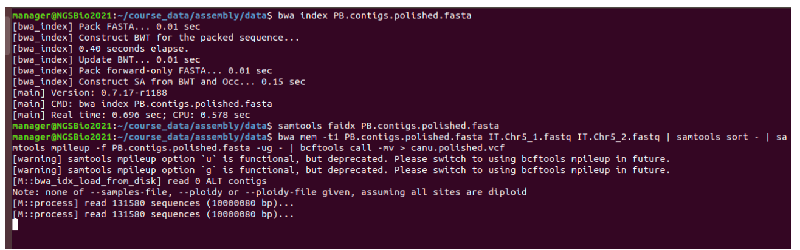

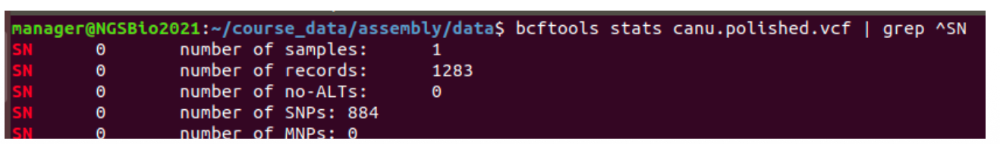

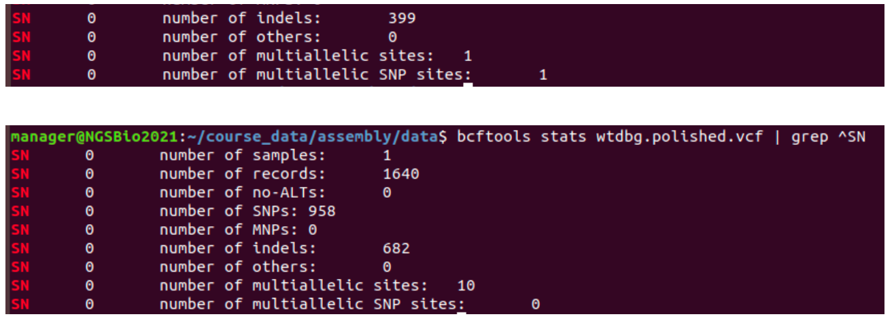

### Conclusion

After polishing, **fewer variants are detected**, indicating that many sequencing and assembly errors have been corrected.
