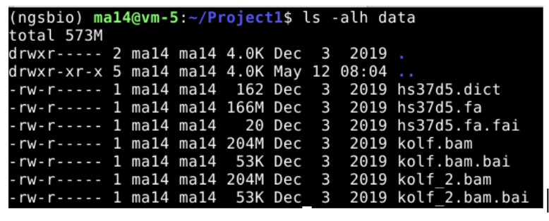

### General guidance for project

Recommended number of participants per group: 4 to 6.

Project work running time: 1.5h, on Friday.

Each group will present their work in max 7 minutes, with 3 minutes left for question. Each member of the group would be expected to present at least one slide.

# **Project 1: Comparison of variant callers**

In this project you will compare three widely used variant callers: BCFtools, FreeBayes and GATK using a 50 Mb region from human chr6.

You will

-   Run the three variant callers on the same dataset

-   Compare the number of SNPs and indels identified

-   Assess callset quality using transition/transversion (ts/tv) ratios

-   Compare raw and filtered callsets

-   Identify shared and private variants using bcftools isec

-   Interpret how filtering and caller choice affect variant discovery

## **Data download**

You will use two iPS cell lineages kolf and kolf_2 from the [HipSci project](http://www.hipsci.org). Download a tarball from ... with the scripts and unpack and prepare the data as follows

```         
**\# Create project directory and change to it**

mkdir \$HOME/Project1 && cd "\$\_"

**\# Download and extract the files**

wget -O variant-calling-comparison.tgz <https://tinyurl.com/y3srttso>

tar xvfz variant-calling-comparison.tgz 

rm variant-calling-comparison.tgz
```

Let us look into the data

{width="425"}

Inside the folder you will have the reference fasta file (.fa) with its corresponding index (.fai) and dictionary (.dict) files. And two bam files with their index file (.bai)

## **Variant calling tools to be used**

-   [bcftools mpileup](https://samtools.github.io/bcftools/bcftools.html#mpileup)

-   [freebayes](https://github.com/freebayes/freebayes)

-   [GATK HaplotypeCaller](https://gatk.broadinstitute.org/hc/en-us/articles/360037225632-HaplotypeCaller)

## **Tasks**

**Task 1:** Run the three variant callers (should take 20 - 25min):

+-------------------------------------------------------------------------------------------------------------------------------------------------------------------------+
| bcftools mpileup -r 6 -f data/hs37d5.fa data/kolf.bam data/kolf_2.bam -Ou \| bcftools call -mv -Oz -o bcftools.vcf.gz                                                   |
|                                                                                                                                                                         |
| freebayes -r 6 -f data/hs37d5.fa data/kolf.bam data/kolf_2.bam \| bcftools view -Oz -o freebayes.vcf.gz                                                                 |
|                                                                                                                                                                         |
| java -Xms4g -Xmx4g -jar bin.part/gatk.jar HaplotypeCaller -R data/hs37d5.fa -I data/kolf.bam -I data/kolf_2.bam -L 6 -O /dev/stdout \| bcftools view -Oz -o gatk.vcf.gz |
+-------------------------------------------------------------------------------------------------------------------------------------------------------------------------+

**Task 2:** Create stats for the raw callsets, note the number of SNPs, indels, and ts/tv ratio.

**Task 3:** Filter the calls, require QUAL\>20 and note the number of SNPs, indels and ts/tv of the filtered callset. Can you explain the differences, especially the GATK tool?

**Task 4:** Use the command bcftools isec on the to find variants with QUAL\>20 called by all three tools (presumably the highest-confidence calls). Explore the output. What is the ts/tv of variants in the intersection?

**Task 5:** The variants called by one program only (presumably enriched for errors). What is the ts/tv of variants private to the callers?
