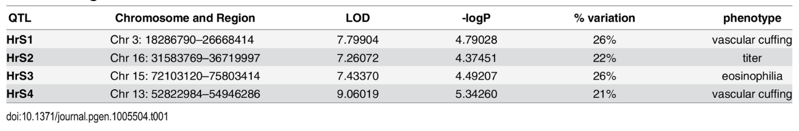

Understanding how host genetic variation influences coronavirus disease severity is challenging in humans because outbreaks are sporadic, acute-phase samples are limited, and human populations are genetically heterogeneous. To address this, researchers developed the Collaborative Cross (CC), a genetically diverse mouse resource generated from eight founder inbred strains: A/J, C57BL/6J, 129S1/SvImJ, NOD/ShiLtJ, NZO/HILtJ, CAST/EiJ, PWK/PhJ, and WSB/EiJ. These founder strains showed markedly different responses to SARS-CoV infection.

-   NOD/ShiLtJ being resistant, 

-   A/J, C57BL/6J, 129S1/SvImJ, and NZO/HILtJ showing moderate transient disease,

-   CAST/EiJ, PWK/PhJ, and WSB/EiJ exhibiting severe susceptibility characterized by substantial weight loss and mortality. 

In a previous study, researchers used the eight founder strains and over 140 other strains to perform quantitative trait loci (QTLs) to identify loci contributing to SARS-CoV pathogenesis. 

Four loci were identified as major contributor to host response to SARS-CoV (HrS); these are HrS1, HrS2, HrS3, and HrS4, located on chromosomes 3, 16, 15, and 13, respectively. Among these, the HrS1 locus was linked to vascular cuffing severity and was refined to a region containing a strong candidate gene, Trim55, the principle regulator of vascular cuffing after infection. Fluid vascular cuffing has been reported to decrease lung compliance suggesting an important physiologic consequence of this response. 

**References**

Genome Wide Identification of SARS-CoV Susceptibility Loci Using the Collaborative Cross

<https://journals.plos.org/plosgenetics/article?id=10.1371/journal.pgen.1005504> 

In this project, you will focus specifically on the HrS1 locus and characterize genetic variants within Trim55 across 52 inbred mouse strains to identify candidate mutations which could be driving susceptibility or resistance SARS-CoV infection.

## Data download

1.  Open the Firefox browser in the VM

2.  Download VCF with SNPs and indels of the 52 mouse strains. (Note: The full VCF is available from the European Variation Archive under PRJEB43298. However, the VCF file for the whole genome is very large. In this project, we will only focus on chromosome 3, which can be downloaded [here](https://drive.google.com/file/d/1dNfcO49nov0MzA2UIuOStJIlc1y_oZ3w/view?usp=sharing)) 

3.  Download reference for chromosome 3 of mouse [here](https://ftp.ensembl.org/pub/current_fasta/mus_musculus/dna/Mus_musculus.GRCm39.dna.chromosome.3.fa.gz).

## Tasks

**Task 1** Using the VCF file, extract the SNP and indel variants found in the Trim55 gene

**Task 2** Identify variants that are most likely to affect the function of the gene (see the CSQ tag). Which strains have missense mutations in the gene? 

Here is a guide which describes the CSQ annotations of the variants: <https://m.ensembl.org/info/genome/variation/prediction/predicted_data.html> 

**Task 3** Summarise your findings of potential mutations in Trim55 that mediate response to SARS-CoV pathogenesis in mice

\
**Task 4** (Extra) If there is time, can you look for potential causative mutations in other quantitative trait loci identified in the table below (Table 1 from the reference paper). You will need the full VCF file to extract only the chromosome of interest, and also the matching reference genome.

## Recommended tools

-   bcftools view

-   bcftools query

-   tabix

-   IGV
