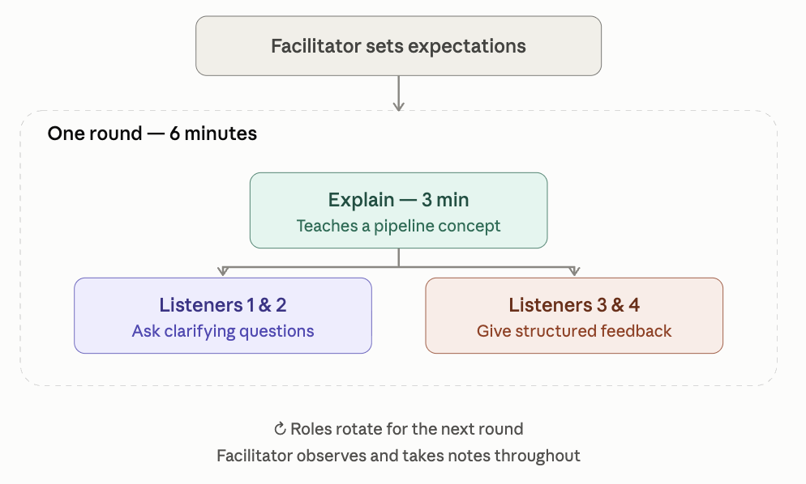

**Teach-as-you-go sessions** are a peer-learning format built around a simple idea: the best way to find out whether you really understand something is to try explaining it to someone else.

In groups of five, participants take turns explaining a concept from the Genome Sequence Analysis pipeline in just three minutes, then open the floor for a short structured discussion. Two listeners play the role of curious students, asking clarifying questions to test the explanation. The other two act as feedback-givers, reflecting back what was clear and what wasn't. A facilitator sets the tone up front — making clear this isn't a test of knowledge, just a space to practice explaining and get useful feedback — and quietly observes throughout to capture how the session unfolds.

The format works because it separates *understanding* from *performing*. Stumbling over an explanation doesn't mean you don't know the material; it just shows you where the gaps in your mental model are, which is exactly the point. Visual aids — a whiteboard sketch, a diagram on screen — help explanations land, and participants are welcome to lean on AI tools if they need a quick way to clarify a concept before presenting it.

Over a few rounds, everyone gets a turn to teach, to question, and to give feedback — turning what could be a one-way lecture into a shared, low-stakes way of reinforcing the pipeline concepts as a group.

**How the activity works**

-   Split into groups of 5

-   **The facilitator** sets the expectations:

    -   “This is not a test”, “If you cannot explain the concept perfectly at this point, this does not mean that you do not know the concepts, or that you won’t be able to learn them later”

    -   Explains how the session will work: “In this session, participants will take turns to explain one concept of the Genome Sequence Analysis pipeline and then they will receive feedback.”

Roles rotate.

**Format**

-   3 min: A participant explains a concept from a list

-   3 min discussion:

    -   Two participants, listeners 1 and 2 act as students (ask clarifying questions)

    -   Two other participants, Listeners 3 and 4 (give feedback using prompts), ie, ask listeners 1 and 2: “What was clear?” “What was confusing?”

**The facilitator observes and takes notes on how the activity goes.**

**How to offer feedback on an explanation**

-   We are giving feedback on the explanation, not the person

-   Mention: What worked well? What was clear? What helped understanding? What examples were effective? Was the structure logical?

-   Give one suggestion for improvement

**Other aspects**

-   Visual aids are really important. People that they can demonstrate things on screen or using flip charts and whiteboards.

-   Participants can resort to AI tools to clarify concepts

## Questions for the "How to teach: Introduction to Linux":

**Foundations**

1\. What is an operating system, and what role does it play between hardware and the user?

2\. What is Linux, and how does it differ from Windows or macOS?

3\. What's the difference between a terminal, a shell, and a command-line interface?

**Navigation & the file system**

4\. What is the Linux file system structure, and why is it described as "hierarchical" or "tree-like"?

5\. What's the difference between an absolute path, a relative path, and a path using \~?

6\. What do ., .., \~, and / mean in a path, and how does cd use them?

7\. What do pwd and ls do, and why are they usually the first two commands you run?

8\. Is Linux case-sensitive, and why does that trip up almost every beginner?

**Files, permissions, and options**

9\. What is an "option" in a Unix command (e.g. -l, -a, -h), and how can single-letter options be combined?

10\. What's the difference between cp and mv, and why should you be careful with rm?

11\. What does find do, and how is it different from ls?

12\. What are file permissions, and how are they organized for owner, group, and others?

13\. What's the difference between cat, less, head, and tail for viewing file contents?

14\. What does man do, and why is it useful?

**Viewing and searching file content**

15\. What does grep do?

16\. Why do regular expressions like \^, \$, ., and \* make grep more powerful and precise?

**Combining commands & processing data**

17\. What does the \> symbol do, and how is that different from what \| (pipe) does?

18\. What's the difference between sort file.txt \> out.txt and sort file.txt \>\> out.txt?

19\. What do wc, sort, and uniq do, and why are sort and uniq often used together?

20\. What is awk, and how does it use columns (\$1, \$2) to process data?

21\. What does a wildcard like \* do in a command such as ls \*.txt?

**Bash scripting**

22\. What is a for loop used for in Bash, and why is it useful for running the same analysis on many files?

23\. What is a Bash script, and what makes it "well-behaved" (e.g. checking \$# for the right number of arguments)?

24\. How does awk use patterns and actions (pattern {action}) to filter or process data?

## Questions for the "How to teach: File Formats & QC":

**File Formats and data structures**

1.  What are index files and why are they needed?
2.  How is the flag constructed in a BAM file?
3.  What does flag 99 mean, and how to decode it?
4.  What is the difference between a sorted and an unsorted BAM file?
5.  What does RG stand for in SAM/BAM file? What happen if the RG is missing?
6.  In CIGAR string, what is the difference between 'M' and 'X'?

**Quality Control (QC)**

7.  How are quality scores calculated?
8.  What is a Phred quality score and how is it interpreted?
9.  Should you perform the adapter trimming step? If yes, why?
10. What are adapters and why must they be removed?
11. What are PCR duplicates? How are they calculated and marked in a BAM? Does it reduce read depth?
12. When could be the reasons for seeing over-represented sequences?
13. What is GC content and why do we check it in quality control?
14. What is the difference between raw reads and cleaned reads?
15. What is sequencing coverage and why is it important?
16. What is the difference between a SNP and an indel?

**Sequencing and library prep**

17. What is a mate-pair library?
18. What is the difference between single-end and paired-end sequencing?

## Questions for "How to teach: Read alignment":

**Reference genome**

1.  What qualities would you look for in a reference genome?
2.  What happens if you don't index your reference sequence?
3.  What happens if there is mismatch chromosome identifier between BAM and reference genome, for example 'chr1' vs '1'?

**Read alignment**

4.  What happens if you don't sort your BAM file? If you don't index it?
5.  If you don't mark duplicates, how might that affect variant calling later on?

**Post-alignment QC**

6.  What causes adapter sequences to be included at the ends of reads (adapter contamination)?
7.  What mapping quality (MAPQ) score is considered acceptable?
8.  What it is mean if the base-calling score is Q30 but mapping quality score is Q0?
9.  What causes library duplicates to appear? What might be indicated by a very high duplication rate?\
10. What's the difference between soft clipping and hard clipping?
11. What SAM flags are you likely to get for a pair of reads that mapped properly?
12. What's the difference between a secondary alignment (SAM flag 256) and a supplementary alignment (flag 2048)?

**IGV**

13. I've just loaded my alignment in IGV. What do I do or look for next?
14. In IGV, some reads are red, others have bands with many colors, and most are gray. What does that mean?
15. If you don't filter out duplicate reads in the view settings of IGV, what would you expect to see, and why?

**NGS workflow**

16. If a sample isn't split across multiple sequencing runs, would merging still be necessary? Why or why not?
17. What happens if you performed de-duplication before merging?

## Questions for "How to teach: Genome Assembly"

### Assembly Concepts and Algorithms

1.  What is a contig and how is it different from a scaffold?

2.  What are de Bruijn graphs and why are they used in short-read genome assembly?

3.  What is the Overlap-Layout-Consensus (OLC) algorithm? When would you use it?

4.  Why are paired-end and linked-read data useful for scaffolding genome assemblies?

### Sequencing Data and Assembly Challenges

5.  What challenges do repetitive sequences pose to genome assembly?

6.  How does read length and coverage affect genome assembly?

7.  How does heterozygosity affect genome assembly?

8.  Why is metagenomic assembly generally more difficult than single-organism assembly?

9.  When running Velvet, I try k=31 and get an N50 of 5 Kb, and then I try k=55 and get an N50 of 8 Kb. Should I keep increasing the k value?

10. In my GenomeScope profile (k-mer plot), I observe distinct peaks at 20X and 40X coverage. What does that say about my genome’s heterozygosity?

### Assembly Quality Assessment

11. How do I assess the quality of a genome assembly?

12. What does N50 mean, and why is a higher N50 generally better?

13. What is BUSCO, and when should I use it, and when not to use it (or interpret it with care)?

### Genome Representation and Assembly Strategy

14. What is diploid assembly and how does it differ from haploid consensus assembly?

15. Is it better to produce a reference genome from one individual, or a pool of multiple individuals? Why?
