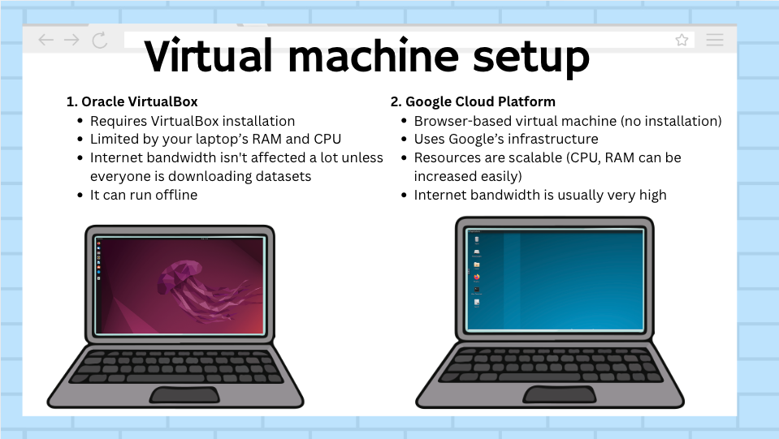
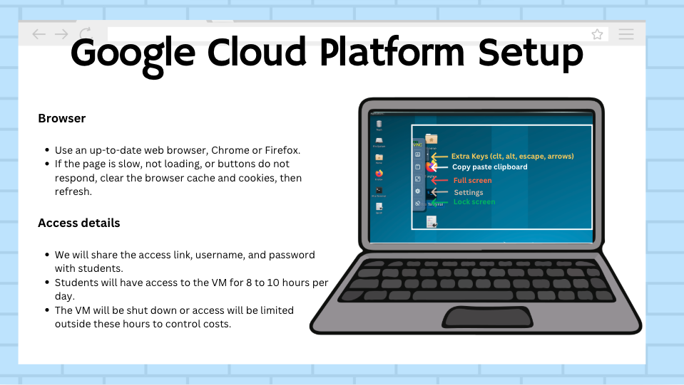
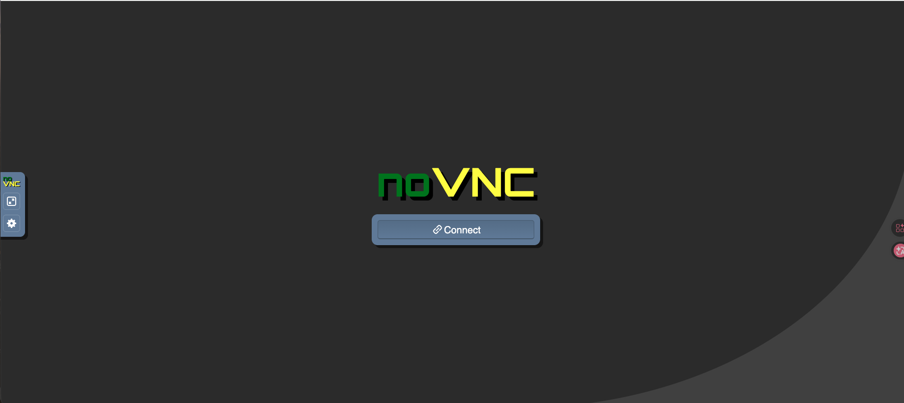
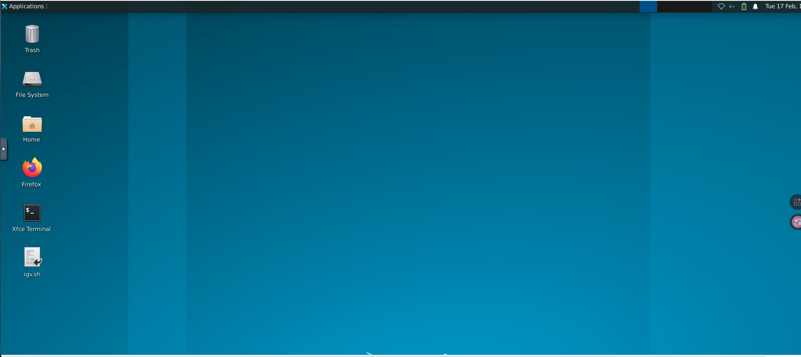
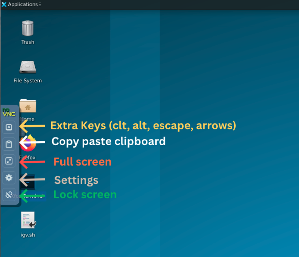
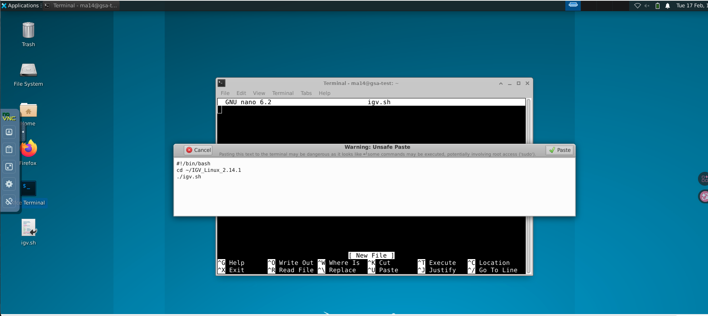
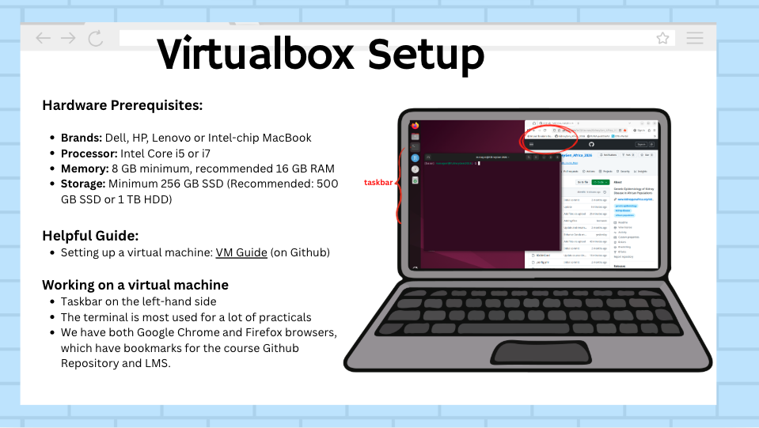
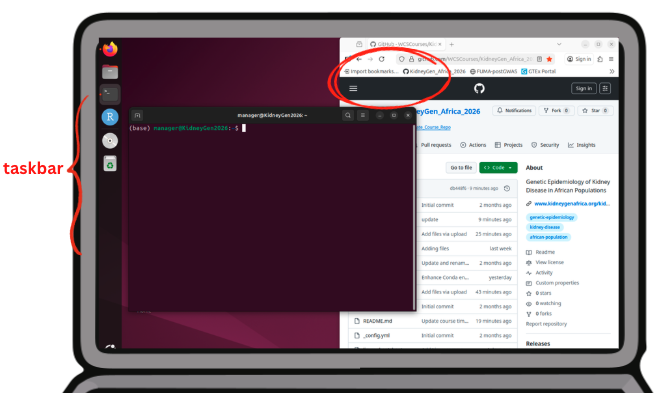

This guide explains how you will access and use the computing environment during the course.

# What is a Virtual Machine?

A **Virtual Machine (often shortened to VM)** is a complete computer system that runs inside your own computer. It behaves like a separate laptop with its own operating system, software, and files.

For this course:

-   The VM already has **all the required bioinformatics tools installed, and the course data downloaded**.
-   Everyone uses the **same setup**, so the results are consistent.
-   You do not need to install software manually.

# Two Available Computing Setups

This course provides two ways to access the computing environment:

-   VirtualBox runs locally on your laptop.
-   Google Cloud Platform (GCP) runs remotely in your browser.

{fig-alt="Comparison between VirtualBox and Google Cloud Platform virtual machine setups."}

Different classrooms in this course will have a different setup for the course participants. Please check the table below to see which classroom settings you will be using.

## Google Cloud Platform (GCP)

The Google Cloud Platform (GCP) Virtual Machine is a remote version of the course environment that runs on cloud servers rather than on your local computer. You access it through your web browser, so no installation is required on your laptop. It provides the same tools and setup as the VirtualBox VM, but everything runs remotely.

{fig-alt="Information slide on Google Cloud Platform setup."}

### How it works and how to access it

The local trainer will provide a URL (web link) and login details. Open this link in your browser (Firefox recommended), enter the password when prompted, and wait for the virtual desktop to load. Once connected, you will see a full desktop environment in your browser and can interact with it as you would on a normal computer, using your mouse and keyboard. Think of it as controlling another computer through your browser.

If the page does not load when you click on the web link:

-   Refresh the page.
-   Try opening it in Firefox or any other browser in incognito mode.
-   Check your internet connection.
-   Ensure you are using the correct URL.
-   Contact your local trainer if the issue persists.

Optional: enable auto-reconnect in noVNC on the student side:

-   Inside the noVNC interface, click **Settings**.
-   Enable **Reconnect automatically**.
-   Set the reconnect delay to 2-5 seconds.
-   If the browser briefly pauses, it should reconnect automatically.

{fig-alt="Lock screen shown when accessing the GCP VM."}

{fig-alt="Homepage after logging in to the GCP VM, showing the Xfce Terminal option."}

### Copy and paste (bidirectional) and screen setup

When using the GCP Virtual Machine through your browser, copy and paste works via the built-in noVNC clipboard. This allows you to transfer text both ways between your computer and the VM. Please refer to the screenshots below.

To copy text from your computer to the VM:

-   Copy the text on your computer using <kbd>Ctrl</kbd> + <kbd>C</kbd> or <kbd>Cmd</kbd> + <kbd>C</kbd>.
-   In the noVNC window, click the clipboard icon on the left toolbar.
-   Paste the text into the clipboard panel.
-   Inside the VM, paste it into the terminal or application using <kbd>Ctrl</kbd> + <kbd>V</kbd>.

To copy text from the VM to your computer:

-   Select and copy the text inside the VM.
-   Open the noVNC clipboard panel.
-   Copy the text from the panel to your computer.

### Using a split screen view

To work efficiently during the course, it is recommended to use a **split screen layout**:

-   One half of your screen for the **GCP VM terminal**.
-   The other half for the **browser with course materials on GitHub**.

This allows you to:

-   Read instructions while typing commands.
-   Reduce switching between windows.
-   Follow practical steps more easily.

Keeping the terminal and course materials visible at the same time will make the practical sessions smoother and faster.

{fig-alt="Opening the noVNC side menu by clicking the three floating dots on the left-hand side of the screen."}

{fig-alt="Browser clipboard permission prompt shown when copy-pasting from the clipboard."}

## VirtualBox setup

The Virtual Machine (VM) is a pre-configured Linux system that contains all the tools and datasets required for the course. It runs on your own computer using VirtualBox.

{fig-alt="Information slide on VirtualBox setup."}

### System requirements

The VM file is large and requires sufficient system resources to run smoothly.

Minimum requirements:

-   Disk space: at least 60 GB available. The VM file is approximately 40 GB unzipped.
-   RAM: 8 GB minimum. 16 GB is recommended for better performance.
-   Processor: multi-core CPU. 4 cores are recommended.

::: callout-important
The VM is not compatible with ARM-based MacBooks, such as Apple M1, M2, or M3 devices.
:::

### Download the Virtual Machine

The Virtual Machine (VM) file is hosted on Globus, a platform designed for reliable transfer of large files. To download it, you will need to create a Globus account and access the file through the provided link. Globus is used because it allows downloads to resume if interrupted, making it more reliable than standard downloads for large files.

-   Create a Globus account at <https://www.globus.org>.
-   Access the VM file using this link: <https://g-0329b9.4c5f14.75bc.data.globus.org/GSA2026.vdi.zip>.
-   File size: approximately 20 GB zipped and 40 GB unzipped.
-   Download time will depend on your internet speed.
-   Ensure you have at least 60-80 GB of free disk space before downloading.
-   Use a stable internet connection for the best results.
-   Globus allows downloads to resume from where they stopped if interrupted.
-   After downloading, unzip the file to obtain the `.vdi` file.
-   Import the `.vdi` file into VirtualBox to start using the VM.

### Install VirtualBox

VirtualBox is a free and open-source software that allows you to run a Virtual Machine (VM) on your computer. It creates a virtual environment where you can run a separate operating system, in this case Linux, without affecting your main system. This is how you will access the pre-configured course environment.

VirtualBox software can be downloaded from <https://www.virtualbox.org/>.

Please note that you will need administrator access on your laptop to install VirtualBox. If you are using a work-managed device, you may need to request installation through your IT support team. Additionally, the current shared `.vdi` file is not compatible with Apple Silicon-based VirtualBox installation.

Detailed setup instructions with images are available in the [Oracle VM VirtualBox Installation Guide](https://wcscourses.github.io/Genome-Sequence-Analysis-Standardised-Resources/course_modules/VM_guide/VM_Guide.html).

### Working on a Linux VirtualBox VM

Once the Virtual Machine is running, you will see a Linux desktop environment.

-   Log in to the virtual machine with the password: `manager`.
-   On the left-hand side, there is a taskbar with commonly used applications pinned for easy access.
-   The Terminal, shown as a black icon, is the main tool you will use during practical sessions to run commands and complete exercises.
-   A Firefox browser is available, with bookmarks already set up for:
    -   The course GitHub repository with slides, exercises, and guides.
    -   The Learning Management System (LMS) for course access and communication.
-   Most of your work during the course will take place in the terminal, with the browser used alongside it to follow instructions and access materials. We recommend keeping your screen split, with half the terminal open and half the browser open, so you can read the manual while typing commands more easily.

{fig-alt="VirtualBox interface."}

## Course materials on GitHub

All course materials are hosted on GitHub and can be accessed here: <https://wcscourses.github.io/Genome-Sequence-Analysis-Standardised-Resources/>.

This website will be your main reference throughout the course and includes:

-   Lecture slides for each topic.
-   Practical exercises with step-by-step instructions.
-   Tutorials and walkthroughs for key analyses.
-   Helpful guides and supporting documentation.

How you will use it:

-   Follow the practical instructions during sessions.
-   Copy and run commands directly in your terminal.
-   Refer back to slides and notes for clarification.
-   Use it as a reference during and after the course.

### Recommended setup

Keep the GitHub page open alongside your Virtual Machine:

-   One half of your screen: Terminal (VM).
-   Other half: GitHub course materials.

This allows you to read instructions while typing commands, making the workflow much easier.

### Frequently asked questions about GitHub course materials

**Do I need to log in to access the GitHub materials?**

No, all course materials are publicly available. You can access them directly without creating a GitHub account.

**When will the lecture slides be available?**

Slides will be available on GitHub after each session.

**When will answers to practical exercises be shared?**

Answers will typically be uploaded to GitHub the following day. In addition, walkthroughs and explanations may also be shared during the course sessions.

**How long will I have access to the materials?**

You will have access indefinitely, as long as the website is available online. We recommend bookmarking the page so you can easily return to it.

**Can I download and reuse the materials?**

Yes, you are free to download and reuse the materials for teaching or learning purposes. However:

-   You must credit Wellcome Sanger Institute.
-   The materials are shared under a Creative Commons licence.
-   Commercial use is not permitted.

**Will session recordings be available?**

Yes, lectures will be recorded, but they may not be available immediately. There will be a delay while videos are edited, uploaded, and reviewed for consent before sharing.

**Who should I contact if I face an issue at any point?**

Your first point of contact should be your local instructors and classroom assistants. You can also reach out via the WhatsApp group for support.
